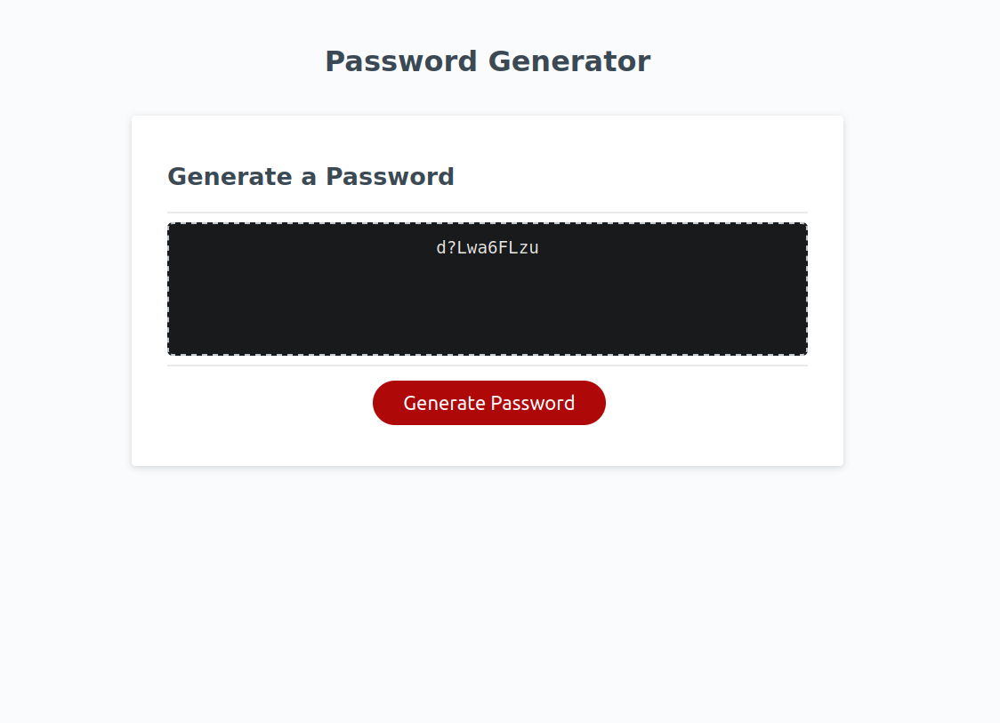

# Javascript Random Password Generator

# Description
This web application lets the user first specify how many characters they want in their password, then prompts what sets of characters to use: upper, lower case, numbers, and special characters. Once entered, a random string is generated at the users specified length and including the chosen characters.
# Usage
[The live site can be visited here](https://benrodriguezmoran.github.io/JS-random-password-generator/index.html)
# Credits
MSU Full-stack Bootcamp Coursework, MDN Reference
# License
Please refer to the license in the repo
